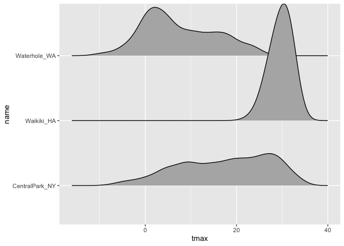

viz_part_01
================

# Lets import data

``` r
weather_df = 
  rnoaa::meteo_pull_monitors(
    c("USW00094728", "USC00519397", "USS0023B17S"),
    var = c("PRCP", "TMIN", "TMAX"), 
    date_min = "2017-01-01",
    date_max = "2017-12-31") %>%
  mutate(
    name = recode(
      id, 
      USW00094728 = "CentralPark_NY", 
      USC00519397 = "Waikiki_HA",
      USS0023B17S = "Waterhole_WA"),
    tmin = tmin / 10,
    tmax = tmax / 10) %>%
  select(name, id, everything())
```

    ## Registered S3 method overwritten by 'hoardr':
    ##   method           from
    ##   print.cache_info httr

    ## using cached file: ~/Library/Caches/R/noaa_ghcnd/USW00094728.dly

    ## date created (size, mb): 2022-10-14 17:45:03 (8.411)

    ## file min/max dates: 1869-01-01 / 2022-10-31

    ## using cached file: ~/Library/Caches/R/noaa_ghcnd/USC00519397.dly

    ## date created (size, mb): 2022-10-14 17:45:09 (1.697)

    ## file min/max dates: 1965-01-01 / 2020-02-29

    ## using cached file: ~/Library/Caches/R/noaa_ghcnd/USS0023B17S.dly

    ## date created (size, mb): 2022-10-14 17:45:12 (0.952)

    ## file min/max dates: 1999-09-01 / 2022-10-31

# Basic scatterplot

### We’ll use the `weather_df` data throughout, so we’ll move straight into defining aesthetic mappings. To create a basic scatterplot, we need to map variables to the X and Y coordinate aesthetics:

``` r
ggplot(weather_df, aes(x = tmin, y = tmax))+
  geom_point()
```

    ## Warning: Removed 15 rows containing missing values (geom_point).

<!-- --> \### The
code below could be used instead to produce the same figure. Using this
style can be helpful if you want to do some pre-processing before making
your plot but don’t want to save the intermediate data.

``` r
weather_df %>%
  drop_na() %>% 
  filter(name=="CentralPark_NY") %>% 
  ggplot(aes(x = tmin, y = tmax)) + 
  geom_point()
```

<!-- -->

### You can also save the output of ggplot() to an object and modify / print it later. This is often helpful, although it’s not my default approach to making plots.

``` r
plot_weather = 
  weather_df %>%
  drop_na() %>% 
  ggplot(aes(x = tmin, y = tmax)) 

plot_weather + geom_point()
```

<!-- -->

\#Advanced scatterplot

### The basic scatterplot gave some useful information – the variables are related roughly as we’d expect, and there aren’t any obvious outliers to investigate before moving on. We do, however, have other variables to learn about using additional aesthetic mappings. Let’s start with name, which I can incorporate using the color aesthetic:

-   Alpha is the transparency
-   Se is the error bar adjusting
-   When color goes with geom_point-\> one whole line and when
    geom_point goes with aes -\> three separate lines

``` r
ggplot(weather_df, aes(x = tmin, y = tmax)) + 
  geom_point(aes(color = name))+geom_smooth()
```

    ## `geom_smooth()` using method = 'gam' and formula 'y ~ s(x, bs = "cs")'

    ## Warning: Removed 15 rows containing non-finite values (stat_smooth).

    ## Warning: Removed 15 rows containing missing values (geom_point).

<!-- -->

``` r
weather_df %>% 
  drop_na() %>% 
  ggplot(aes(x=tmin,y=tmax,color=name))+
  geom_point(alpha = .5)+
  geom_smooth(se = FALSE)
```

    ## `geom_smooth()` using method = 'loess' and formula 'y ~ x'

<!-- -->

### I’m going to add facet based on name as well.

``` r
weather_df %>% 
  drop_na() %>% 
  ggplot(aes(x=tmin,y=tmax,color=name))+
  geom_point(alpha = .5)+
  geom_smooth(se = FALSE)+
  facet_grid(. ~ name)
```

    ## `geom_smooth()` using method = 'loess' and formula 'y ~ x'

<!-- --> \###
Awesome! I’ve learned a lot about these data. However, the relationship
between minimum and maximum temperature is now kinda boring, so I’d
prefer something that shows the time of year. Also I want to learn about
precipitation, so let’s do that.

``` r
weather_df %>% 
  drop_na() %>% 
  ggplot(aes(x=date,y=tmax,color=name))+
  geom_point(alpha=.3,aes(size=prcp))+
  geom_smooth(se=FALSE)+
  facet_grid(. ~ name)
```

    ## `geom_smooth()` using method = 'loess' and formula 'y ~ x'

<!-- -->

# Univariate plots

### Histograms, barplots, boxplots, violins

-   Histograms

``` r
weather_df %>% 
  ggplot(aes(x = tmax,fill=name)) + 
  geom_histogram()+
  facet_grid(.~name)
```

    ## `stat_bin()` using `bins = 30`. Pick better value with `binwidth`.

    ## Warning: Removed 3 rows containing non-finite values (stat_bin).

<!-- -->

``` r
weather_df %>% 
  ggplot(aes(x = tmax,fill=name)) + 
  geom_density(alpha=.3)
```

    ## Warning: Removed 3 rows containing non-finite values (stat_density).

<!-- -->

``` r
weather_df %>% 
  ggplot(aes(x=name,y = tmax,fill=name)) + 
  geom_violin()
```

    ## Warning: Removed 3 rows containing non-finite values (stat_ydensity).

<!-- -->

``` r
weather_df %>% 
  ggplot(aes(x = tmax,y=name)) + 
  geom_density_ridges()
```

    ## Picking joint bandwidth of 1.84

    ## Warning: Removed 3 rows containing non-finite values (stat_density_ridges).

<!-- -->
